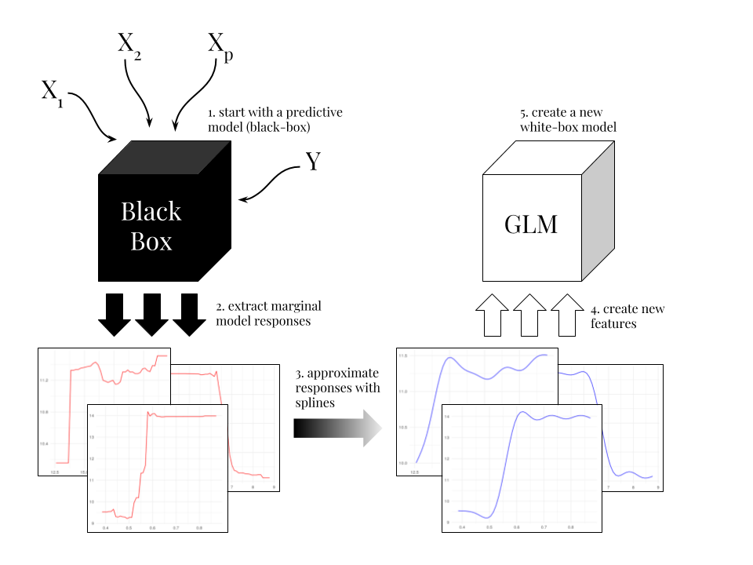

# xspliner - Using surrogate black-boxes to train interpretable spline based additive models

## xspliner's pipeline: *model %>% xspline(...)* and analyze



## Installation from CRAN
```
install.packages("xspliner")
```

## Installation from Github
```
devtools::install_github("ModelOriented/xspliner")
```

## [News](NEWS.md)

## [Reference Manual](https://ModelOriented.github.io/xspliner/)

## DEMO

```
library(xspliner)
library(randomForest)
library(pdp)
data(boston)
set.seed(123)
# fitting random forest model
model_rf <- randomForest(cmedv ~ lstat + ptratio + age, data = boston)

# building GLM (with standard black box response - Partial Dependence)
xspliner <- xspline(model_rf)

# see standard glm results
summary(xspliner)

# see ptratio variable transformation
plot(xspliner, "ptratio")

# compare xspliner and base model responses
plot(xspliner, model = model_rf, data = boston)

```

For more info check project [vignettes](https://ModelOriented.github.io/xspliner/articles/) or [examples](https://github.com/ModelOriented/xspliner/tree/master/examples).

## Further work
See [github issues](https://github.com/ModelOriented/xspliner/issues) 
